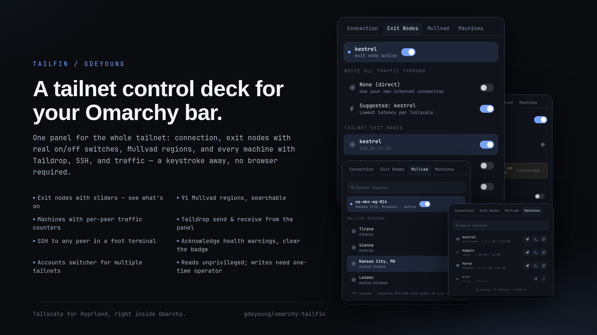

# Tailfin for Omarchy

One panel for the whole tailnet. Connection state, exit nodes with real on/off
switches, Mullvad regions, and every machine with Taildrop, SSH, and traffic
counters — a keystroke from the bar, no browser required.



## The problem

Omarchy ships a first-party Tailscale panel, but it stops short: exit nodes are
pick-then-click with no visible on/off state, there's no Mullvad picker, no
machine list, no file actions, and health warnings can't be dismissed. A
tailnet with dozens of peers does not fit one scroll, and anything serious
means opening a terminal or the web console.

Tailfin is a fork of the stock `omarchy.tailscale` panel that finishes the job:

- **Connection** — hero state with on/off toggle, this-device identity,
  health warnings you can acknowledge (and re-arm), preference toggles
  (route-all, accept-dns, shields-up, allow-LAN), and account switching
- **Exit Nodes** — every tailnet exit node with a slider: on means that node
  is routing your traffic, off means direct. An active-node banner keeps the
  current node visible even when its row is filtered out or scrolled away,
  and Tailscale's suggested node is one row away
- **Mullvad** — the full region list, searchable, with the same slider
  treatment (the tab hides itself on tailnets without Mullvad exit nodes)
- **Machines** — the whole peer list with traffic counters, Taildrop send,
  one-click SSH in a foot window, copy menu, and offline peers collapsed
  behind a count

Only the Machines tab scrolls; everything else fits one view.

<details>
<summary>See the tabs</summary>

| Connection | Exit Nodes |
|---|---|
|  |  |

| Mullvad | Machines |
|---|---|
|  |  |

</details>

## Screenshots

All images in this repo are **synthetic mockups** (`docs/panels.html`,
`docs/poster.html` — regenerate with any headless Chromium). They contain no
real machine names, IP addresses, or tailnet identifiers.

## Keyboard

- `h`/`l` or arrows: switch tabs · `1`–`4`: jump to tab
- `t` toggle Tailscale · `r` refresh
- `c`/`n`/`d` copy selected peer's IP/name/DNS · `s` Taildrop to peer
- In Machines/Mullvad search: `j`/`k` move, Enter activates, Esc clears

## Install

Requires the `tailscale` CLI on PATH (`pacman -S tailscale`); `wl-copy` for
copy actions.

```sh
omarchy plugin add https://github.com/gdeyoung/omarchy-tailfin.git --enable
omarchy plugin disable omarchy.tailscale   # replaces the stock panel
```

### One-time operator setup

Reading status always works. Changing anything — toggling the connection,
switching exit nodes, preferences — needs Tailscale's operator mode, once:

```sh
sudo tailscale set --operator=$USER
```

The panel detects the locked state and shows an **Authorize** row until it's
done (it runs `pkexec tailscale set --operator=$USER` for you — one password
prompt, once per machine; the same one-time unlock Trayscale uses). sudo is
not required by the plugin itself; this command only changes Tailscale's own
access control.

## Taildrop

- **Send** — the paper-plane button on any machine opens your file picker;
  Omarchy's `omarchy-tailscale-send` helper ships the file
- **Receive** — the TAILDROP toggle on the Connection tab starts/stops the
  `omarchy-tailscale-receive` user service (drops into `~/Downloads` with a
  notification)

## IPC (testing)

`qs -p /usr/share/omarchy/shell ipc call gdeyoung.tailfin <verb>` — verbs:
`open`, `close`, `toggle`, `status`, `tab <name>`, `refresh`,
`exitnode <host|ip|"">`, `ack <warning>`, `unack`, `ssh <host>`,
`receive <on|off>`.

## Remove

```sh
omarchy plugin remove gdeyoung.tailfin
omarchy plugin enable omarchy.tailscale   # stock panel back
```

## Credits

Fork of Omarchy's first-party `omarchy.tailscale` panel (MIT), which remains
the foundation — Service and Model logic stay close to upstream so fixes flow
both ways. Tailfin adds the tabs, exit-node sliders, machine actions, Taildrop
controls, health acknowledgement, and the account switcher.

## Development

```sh
node --test tests/model.test.js     # model tests (real captured CLI output)
qmllint -I /usr/share/omarchy/shell Panel.qml Service.qml
omarchy plugin validate .
```

Deploy to `~/.config/omarchy/plugins/gdeyoung.tailfin/` then
`omarchy restart shell`.
